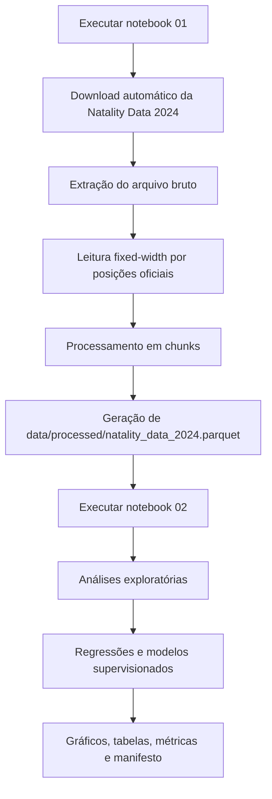

# tcc-utin-natality-2024


Repositório mínimo para executar os notebooks do Trabalho de Conclusão de Curso sobre **estratificação retrospectiva do risco de internação em Unidade de Terapia Intensiva Neonatal (UTIN)** com microdados públicos da **Natality Data 2024**.

O projeto organiza um fluxo reprodutível em Python para obtenção, preparo, análise exploratória, modelagem estatística e avaliação de modelos supervisionados aplicados a dados populacionais de nascimentos.

---

## Escopo do repositório

Este repositório está focado exclusivamente nos requisitos de funcionamento dos notebooks:

| Notebook | Função |
|---|---|
| `01_preparo_reprodutivel_natality_data_2024.ipynb` | Obtém automaticamente os dados públicos, extrai, processa e gera a base Parquet. |
| `02_pipeline_analitico_reprodutivel_natality_data_2024.ipynb` | Carrega a base Parquet, executa análises, modelos, gráficos, tabelas e artefatos finais. |

---

## Estrutura do projeto

```text
.
├── README.md
├── requirements.txt
├── environment.yml
├── .gitignore
├── notebooks/
│   ├── 01_preparo_reprodutivel_natality_data_2024.ipynb
│   └── 02_pipeline_analitico_reprodutivel_natality_data_2024.ipynb
├── scripts/
│   └── run_notebooks.sh
└── data/
    ├── README.md
    ├── raw/
    │   └── natality_2024/
    │       └── .gitkeep
    └── processed/
        └── .gitkeep
```

---

## Ambiente de desenvolvimento

Ambiente de desenvolvimento utilizado/recomendado:

```text
Python >=3.11,<3.14
```

Dependências principais:

| Grupo | Pacotes |
|---|---|
| Execução de notebooks | `ipykernel`, `nbformat`, `nbconvert`, `notebook` |
| Manipulação de dados | `numpy`, `pandas`, `pyarrow`, `requests` |
| Extração de arquivos | `zipfile-deflate64` |
| Visualização | `matplotlib` |
| Estatística e machine learning | `scikit-learn`, `xgboost`, `statsmodels` |
| Exportação e diagramas | `openpyxl`, `graphviz` |

---

## Instalação

### Opção 1 — `venv` no Linux/macOS

```bash
python -m venv .venv
source .venv/bin/activate
python -m pip install --upgrade pip
pip install -r requirements.txt
```

### Opção 2 — `venv` no Windows PowerShell

```powershell
python -m venv .venv
.venv\Scripts\Activate.ps1
python -m pip install --upgrade pip
pip install -r requirements.txt
```

### Opção 3 — Conda/Mamba

```bash
conda env create -f environment.yml
conda activate tcc-utin-natality-2024
```

---

## Fluxo de execução



---

## Notebook 01 — obtenção e preparo dos dados

O notebook 01 utiliza uma técnica de **ingestão reprodutível de microdados públicos em formato fixed-width**.

Ele realiza automaticamente:

1. obtenção dos dados públicos da **Natality Data 2024**;
2. extração do arquivo bruto;
3. leitura posicional conforme layout técnico;
4. processamento incremental em blocos;
5. limpeza padronizada;
6. criação de variáveis derivadas;
7. gravação da base final em formato Parquet;
8. geração de auditorias, hashes e manifesto de reprodutibilidade.

Fluxo técnico:

```text
Fonte pública CDC/NCHS Natality Data 2024
        ↓
Download automático ou reaproveitamento do arquivo local
        ↓
Extração do ZIP/TXT bruto
        ↓
Leitura fixed-width por posições oficiais
        ↓
Processamento em chunks
        ↓
Limpeza e criação de variáveis derivadas
        ↓
Gravação em Parquet
        ↓
Auditoria, hashes e manifesto de reprodutibilidade
```

A saída principal esperada é:

```text
data/processed/natality_data_2024.parquet
```

> Não é necessário baixar manualmente os dados para a execução padrão. Basta executar o notebook 01.

---

## Notebook 02 — análise e modelagem

O notebook 02 **não realiza novo download dos microdados brutos**. Ele utiliza como entrada o arquivo Parquet produzido pelo notebook 01.

Arquivo esperado:

```text
data/processed/natality_data_2024.parquet
```

Fluxo de dependência:

```text
Notebook 01
obtém automaticamente os dados públicos da Natality Data 2024
        ↓
extrai, lê e processa o arquivo bruto fixed-width
        ↓
gera data/processed/natality_data_2024.parquet
        ↓
Notebook 02
carrega o Parquet gerado pelo notebook 01
        ↓
cria variáveis derivadas complementares
        ↓
executa análises, modelos, gráficos, tabelas e artefatos finais
```

O notebook 02 pode localizar automaticamente o arquivo Parquet em diretórios previstos do projeto, especialmente:

```text
data/processed/
```

Também pode procurar em diretórios alternativos gerados durante execuções locais:

```text
dados_processados/
dados_finais/
dados_intermediarios/
dados/
data/
outputs/
```

Caso o arquivo esteja em outro local, informe o caminho completo pela variável de ambiente:

Linux/macOS:

```bash
export NATALITY_PARQUET_PATH="/caminho/para/natality_data_2024.parquet"
```

Windows PowerShell:

```powershell
$env:NATALITY_PARQUET_PATH="C:\caminho\para\natality_data_2024.parquet"
```

---

## Como executar

### Execução manual

Execute primeiro o notebook 01:

```bash
jupyter notebook notebooks/01_preparo_reprodutivel_natality_data_2024.ipynb
```

Depois execute o notebook 02:

```bash
jupyter notebook notebooks/02_pipeline_analitico_reprodutivel_natality_data_2024.ipynb
```

### Execução automatizada

```bash
bash scripts/run_notebooks.sh
```

---

## Dados e versionamento

Os microdados brutos e arquivos derivados grandes **não são versionados no GitHub**.

Durante a execução, os arquivos podem ser salvos em:

```text
data/raw/natality_2024/
data/processed/
```

Arquivos grandes devem permanecer fora do versionamento, incluindo:

```text
*.zip
*.txt
*.csv
*.xlsx
*.parquet
*.pkl
*.joblib
*.model
```

---

## Saídas geradas localmente

Durante a execução, os notebooks podem criar pastas como:

```text
outputs/
dados_brutos/
dados_intermediarios/
dados_finais/
logs/
```

Essas pastas correspondem a artefatos de execução local e devem ser ignoradas pelo Git.

---

## Artefatos esperados

Entre os principais artefatos gerados estão:

| Artefato | Descrição |
|---|---|
| `data/processed/natality_data_2024.parquet` | Base processada gerada pelo notebook 01. |
| `dados_finais/base_analitica_tcc_utin_rpm_pprom.parquet` | Base analítica consolidada gerada pelo notebook 02. |
| `outputs/tabelas/` | Tabelas intermediárias e finais. |
| `outputs/graficos/` | Gráficos exploratórios e de modelagem. |
| `outputs/modelos/` | Artefatos relacionados aos modelos. |
| `outputs/manifesto/` | Manifestos, auditorias e registros de execução. |

---

## O que não está neste repositório

Este repositório não inclui:

- microdados brutos da Natality Data 2024;
- bases processadas em Parquet;
- saídas geradas pelos notebooks;
- modelos treinados;
- arquivos grandes derivados da execução;
- versão completa do TCC com identificação acadêmica dos autores.

Esses artefatos são produzidos localmente a partir da execução dos notebooks ou mantidos fora do repositório por questões de tamanho, privacidade ou organização.

---

## Aviso metodológico

A proxy RPM/PPROM utilizada no projeto é uma aproximação operacional retrospectiva. Ela:

- não representa diagnóstico clínico individual;
- não mede prevalência real de RPM/PPROM;
- não deve ser usada como ferramenta assistencial prospectiva;
- deve ser interpretada apenas no contexto metodológico e exploratório do estudo.

Os modelos e resultados têm finalidade acadêmica, metodológica e reprodutível. Eles não devem ser interpretados como dispositivo médico, ferramenta clínica, sistema de triagem real ou recomendação assistencial individual.

---

## Referência do projeto

Trabalho de Conclusão de Curso em Ciência de Dados — UNIVESP.

Tema: **Estratificação retrospectiva do risco de internação em UTIN em nascimentos: aplicação de Health Analytics à Natality Data 2024, com ênfase em prematuridade e proxy operacional compatível com contexto de RPM/PPROM**.
